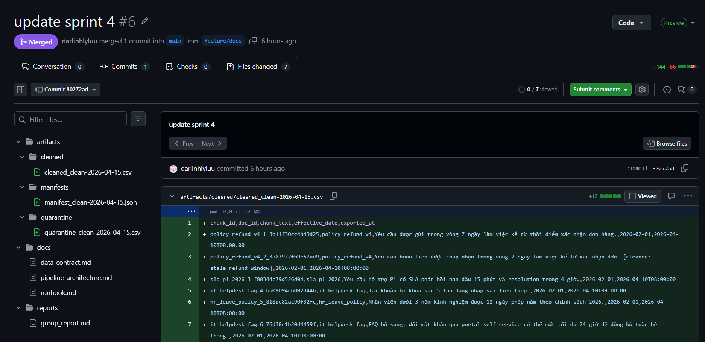

# Báo Cáo Cá Nhân — Lab Day 10: Data Pipeline & Observability

**Họ và tên:** Lưu Linh Ly  
**Vai trò:** Monitoring / Docs Owner (Doc Owner)  
**Độ dài:** ~450 từ

---

## 1. Phụ trách

Tôi phụ trách lớp tài liệu hóa và monitoring của pipeline, tập trung ở các file `docs/pipeline_architecture.md`, `docs/data_contract.md`, `docs/runbook.md`, `docs/quality_report.md`, và phần tổng hợp trong `reports/group_report.md`. Công việc chính của tôi là lấy output kỹ thuật từ các bạn phụ trách ingest, cleaning và embed rồi chuyển thành tài liệu có thể đối chiếu bằng artifact thật. Tôi dùng `run_id`, manifest, log, quarantine CSV và file eval để bảo đảm báo cáo không bị lệch với repo.

Với `docs/data_contract.md`, tôi chịu trách nhiệm mô tả source map, schema cleaned, quy tắc quarantine/drop và canonical source để nối phần code cleaning với phần tài liệu chấm điểm. Với `docs/runbook.md`, tôi viết cách diễn giải symptom, detection, diagnosis, mitigation và prevention cho case stale refund policy và freshness fail.

**Bằng chứng:** `docs/pipeline_architecture.md`, `docs/data_contract.md`, `docs/runbook.md`, `reports/group_report.md`, `artifacts/manifests/manifest_clean-2026-04-15.json`.

---

## 2. Quyết định kỹ thuật

Quyết định kỹ thuật quan trọng nhất của tôi là giữ nguyên cách giải thích `freshness_check=FAIL` thay vì sửa SLA hoặc sửa timestamp chỉ để báo cáo nhìn “đẹp hơn”. Khi đọc `monitoring/freshness_check.py` và manifest của run chuẩn `clean-2026-04-15`, tôi thấy freshness trong repo này đang đo độ mới của snapshot dữ liệu nguồn qua `latest_exported_at`, chứ không đo độ mới của thời điểm chạy pipeline.

Trong `artifacts/manifests/manifest_clean-2026-04-15.json`, trường `latest_exported_at` là `2026-04-10T08:00:00`, còn log run nằm ở ngày `2026-04-15`, nên `freshness_check=FAIL` với SLA 24 giờ là hợp lý. Tôi chọn ghi rõ điều này trong `docs/runbook.md` và `reports/group_report.md`: pipeline vẫn có thể `PIPELINE_OK`, nhưng monitoring phải nói thật rằng dữ liệu nguồn đang stale. Theo tôi, đó là cách viết đúng tinh thần observability hơn là che lỗi bằng cách nới `FRESHNESS_SLA_HOURS`.

---

## 3. Sự cố / anomaly

Anomaly lớn nhất tôi xử lý là lớp bằng chứng trong báo cáo ban đầu không còn khớp hoàn toàn với artifact thật trong repo. Khi đối chiếu `docs/quality_report.md`, `reports/group_report.md`, log `run_clean-2026-04-15.log` / `run_inject-bad-2026-04-15.log`, và các file trong `artifacts/eval/`, tôi thấy có chỗ dùng `run_id` cũ hoặc diễn giải before/after chưa bám đúng file đang tồn tại.

Tôi xử lý theo hướng “evidence-first”: lấy lại số liệu trực tiếp từ `manifest_clean-2026-04-15.json`, `artifacts/logs/run_clean-2026-04-15.log`, `artifacts/logs/run_inject-bad-2026-04-15.log`, rồi viết lại `reports/group_report.md` theo đúng hai run chính là `inject-bad-2026-04-15` và `clean-2026-04-15`. Dấu hiệu giúp tôi phát hiện lệch là log inject ghi `expectation[refund_no_stale_14d_window] FAIL (halt) :: violations=1`, trong khi một số mô tả cũ chưa phản ánh đúng trạng thái đó.

---

## 4. Before/after

**Log:** ở run xấu `inject-bad-2026-04-15`, file `artifacts/logs/run_inject-bad-2026-04-15.log` có dòng `expectation[refund_no_stale_14d_window] FAIL (halt) :: violations=1`. Ở run sạch `clean-2026-04-15`, file `artifacts/logs/run_clean-2026-04-15.log` ghi `expectation[refund_no_stale_14d_window] OK (halt) :: violations=0`.

**Artifact retrieval/grading:** trong `artifacts/eval/grading_run.jsonl`, dòng `gq_d10_01` có `"contains_expected": true, "hits_forbidden": false`, còn dòng `gq_d10_03` có `"top1_doc_matches": true`. Với tôi, đây là bằng chứng sau-fix tốt hơn vì nó cho thấy retrieval không còn kéo theo forbidden context và top-1 cho HR policy đã đúng doc.

## 5. Cải tiến thêm 2 giờ

Nếu có thêm 2 giờ, tôi muốn chuẩn hóa quy trình sinh evidence before/after thành hai artifact cố định như `eval_inject.csv` và `eval_clean.csv`, rồi tham chiếu trực tiếp trong report. Việc này sẽ giúp lớp docs/monitoring không phụ thuộc vào thứ tự rerun của collection Chroma và giảm rủi ro lệch giữa log, eval và báo cáo nhóm. Ngoài ra, tôi cũng muốn bổ sung một bảng mapping rõ hơn giữa `contracts/data_contract.yaml` và `docs/data_contract.md` để việc peer review source map và canonical source nhanh hơn.
